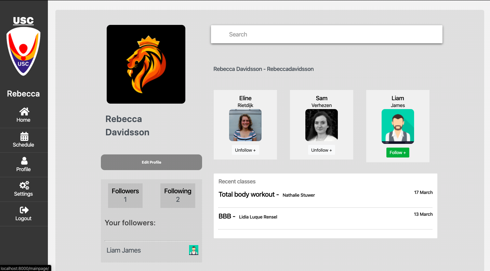
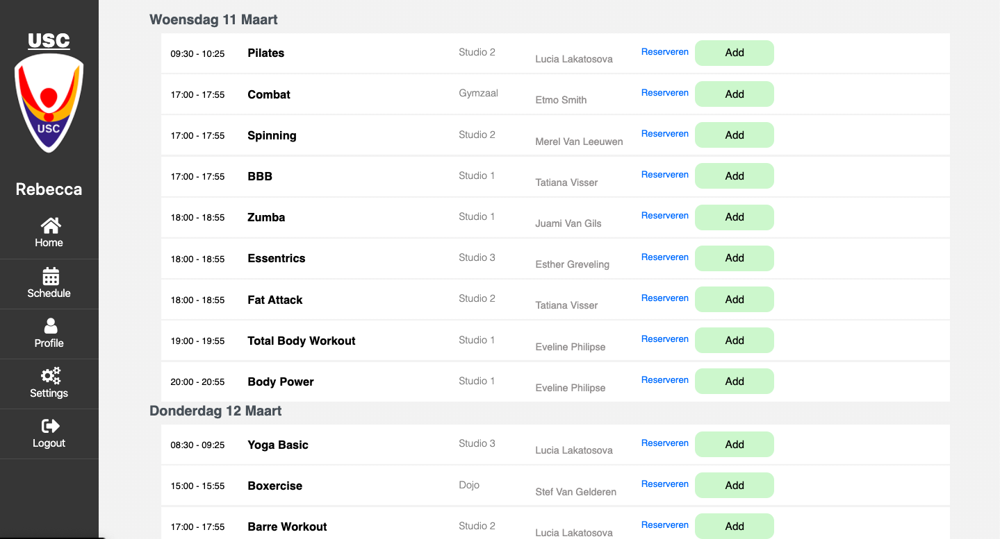

# Social Web VU Amsterdam 2020

The social networking platform for University Sport Centre users.

## Getting Started

First, a short summary is made of the web app. Later on, the installation instructions are summarized. These instructions will get you a copy of the project up and running on your local machine with Python3 for development and testing purposes.

## Overview

### The profile page
This page included all followers, user statistics and a short overview of the history of the user.





### The homepage (calendar)
The homepage includes the interactive calendar that is linked to the USC schedule.


### The schedule
A seperate page is made for the overview of the USC schedule.




# Instructions
### Prerequisites

Before running the project, you will need to install the requirements with the following command

```
pip install -r requirements.txt
```

## Running the server

First, clone this repository with
```
git clone https://github.com/rebeccadavidsson/Social-Web-2020.git
```

In this directory, run the server in a terminal with

```
python3 manage.py runserver
```

This will run the server on a local-host. To access the webserver, go to:
```
localhost:8000
```
in any webbrowser (Chrome is adviced!).


## Built With

* Django
* Beautifulsoup
* PhantomJS

## Authors

* **Rebecca Davidsson** - *Initial work*
* **Sanne Donker** - *Initial work*
* **Annemijn Dijkhuis** - *Initial work*
* **Eline Rietdijk** - *Initial work*
* **Sam Verhezen** - *Initial work* 


## License

This project is licensed under the MIT License - see the [LICENSE.md](LICENSE.md) file for details
